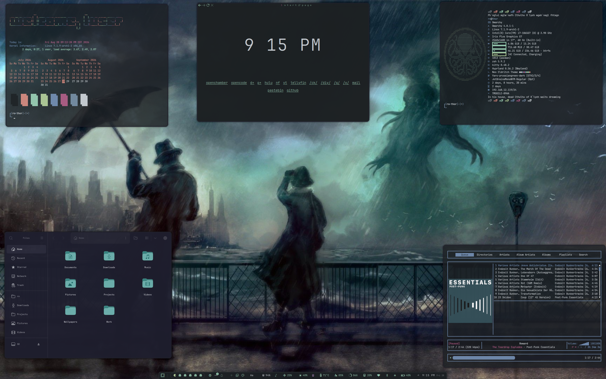

<pre style="line-height: 1.0; font-family: monospace; letter-spacing: 0px;">
                                                               ..    ..                       .         s                          
                                                         x .d88"   dF                        @88>      :8                .uef^"    
   u.    u.                     u.                        5888R   '88bu.         .u    .     %8P      .88              :d88E       
 x@88k u@88c.      .u     ...ue888b                .u     '888R   '*88888bu    .d88B :@8c     .      :888ooo       .   `888E       
^"8888""8888"   ud8888.   888R Y888r            ud8888.    888R     ^"*8888N  ="8888f8888r  .@88u  -*8888888  .udR88N   888E .z8k  
  8888  888R  :888'8888.  888R I888>          :888'8888.   888R    beWE "888L   4888>'88"  ''888E`   8888    <888'888k  888E~?888L 
  8888  888R  d888 '88%"  888R I888>          d888 '88%"   888R    888E  888E   4888> '      888E    8888    9888 'Y"   888E  888E 
  8888  888R  8888.+"     888R I888>          8888.+"      888R    888E  888E   4888>        888E    8888    9888       888E  888E 
  8888  888R  8888L      u8888cJ888  88888888 8888L        888R    888E  888F  .d888L .+     888E   .8888Lu= 9888       888E  888E 
 "*88*" 8888" '8888c. .+  "*888*P"   88888888 '8888c. .+  .888B . .888N..888   ^"8888*"      888&   ^%888*   ?8888u../  888E  888E 
   ""   'Y"    "88888%      'Y"                "88888%    ^*888%   `"888*""       "Y"        R888"    'Y"     "8888P'  m888N= 888> 
                 "YP'                            "YP'       "%        ""                      ""                "P'     `Y"   888  
                                                                                                                             J88"  
                                                                                                                             @%    
                                                                                                                           :"      
</pre>

---

An Omarchy Theme for your Arch Linux / Hyprland setup based on lovecraftian aesthetics and muted colors.

## Installation

To install this theme, simply use the ``omarchy-theme-install``   

command: `` omarchy-theme-install https://github.com/signaldirective/neo-eldritch ``  

  

**Theme by [Signal Directive](https://ko-fi.com/signaldirective)**  

**Additional Credits:** HANCORE for quickshell theme [shibumi shell](https://github.com/HANCORE-linux/Shibumi-Shell)
